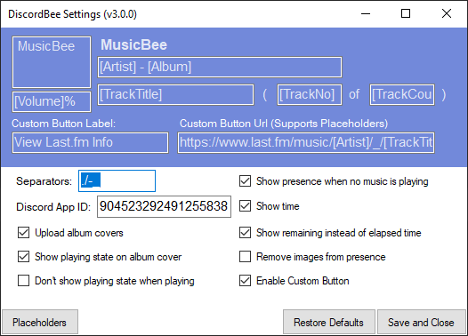
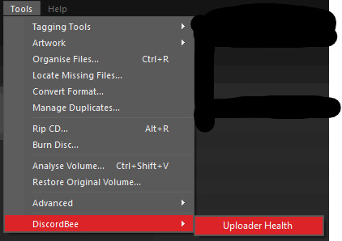
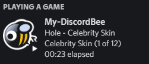
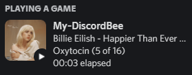
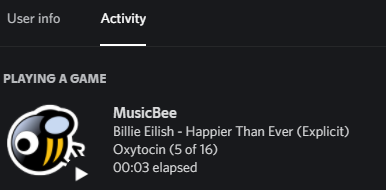

# DiscordBee

MusicBee plugin that updates your Discord status with the currently playing track

## Installation

Just copy all plugin files into your MusicBee Plugins directory (usually "C:\Program Files (x86)\MusicBee\Plugins").

### Microsoft Store Version of MusicBee

If you are using the Store version of MusicBee please use the "Add Plugin" button in MusicBee -> Settings -> Plugins and select the latest release .zip. It may display an error message (something like "... initialise Method not found ..."), ignore it and restart MusicBee. The Plugin should be loaded now.

### Migration from v2.x to v3.x

#### Pre - Installation

If you have currently installed some version 2.x of this plugin please delete all the plugin files from the plugin directory `(x86)\MusicBee\Plugins` before installing version 3.x of the plugin. The files to be removed are:

- `mb_DiscordBee.dll`
- `mb_DiscordBee.dll.config`
- `DiscordRPC.dll`
- `Newtonsoft.Json.dll`

This will **not** remove any custom settings you have made.

#### Settings

The separators setting will be reset to default upon first start of version 3.x. This happens only one time and you can reset it to your previous setting immediately.

## Usage

After installing the plugin start MusicBee and your Discord status should be showing informations about your current song.

The Discord API has a 15s rate limit, so it can take up to 15s for a status change to actually show in Discord.

## Configuration

You can configure what is displayed in your profile by opening the plugin settings in MusicBee "Edit -> Preferences -> Plugins -> DiscordBee -> Configure".

The settings window is designed after the Discord profile view and has all elements editable with the default values preloaded. You can use all metadata fields that MusicBee provides in your custom strings. All valid metadata fields in square brackets will be replaced by the values of the currently playing song.

To see which fields are available press the "Placeholders" button and a window will open containing a table with all fields and their values for the current song.

You can also change which characters are treated as separators. Separator characters will be stripped in certain conditions e.g. a field is empty and the separator would be at the end.

If you are unhappy with your changes, you can always restore the defaults and save again.

### Album Covers

If the cover upload feature is enabled your album covers will be uploaded to an anonymous Imgur album. This album is unique to every instance of the plugin, so nothing is shared between users of the plugin.
You don't need an Imgur account for this feature to work.

When enabling this feature it can take a few minutes until the uploads are working (suspectedly because of a delay in album creation). This only happens when the album is created the first time.

Imgur has rate limits regarding uploads, those are handled by the plugin. There is a global rate limit per application as well as per user. That means even if you did not upload any covers today, it might still not work for you. You can check the status of the uploader in MusicBee under `tools -> DiscordBee -> Uploader Health`.

If the uploader becomes unhealthy only cached covers will work until it becomes healthy again.

### Buttons

If you configure a custom button and would like to test it, you cannot click on the button yourself in the Discord client, this is per design and a limitation by Discord.
You can however use the browser version of Discord to test your button.

### Custom Discord App ID

You can use your own Discord "Application" with this plugin. This enables you to change the default pictures and the name above the presence (which defaults to "MusicBee").

If you want to use a custom App Id you have to create one. Got to https://discord.com/developers/applications/ and login using the account that the plugin is used with. Create a new application with a name of your choice using the button on the top right. After doing so you will get an overview of your new application, here you can copy your `Application ID`.

For your new Application to be useable with the plugin you need to upload the assets that are defined [here](https://github.com/sll552/DiscordBee/blob/master/DiscordTools/Assets/AssetManager.cs#L11-L14).
That means you need to upload one picture for each asset, all assets must be present with their defined names. For example to change the logo which is displayed if album covers are not enabled you need to:
  
  1. Open the Discord developer Dashboard
  1. Select a picture that meets the requirements.
  1. Upload this picture and name the asset `logo`
  1. Upload all the other assets from the [Resources Folder](Resources/Icons/) with their respective names.

When you are done uploading the assets you can take your `Application ID` from the dashboard and insert it in the DiscordBee settings. Now DiscordBee will use your custom Name and assets.

### Custom Imgur Client ID

To circumvent the global rate limits you can use your own Imgur Client ID. This is only recommended if you experience that the uploader health is immediately (after first upload) false even if you haven't used DiscordBee for a day.

To get a client ID you must register an application at Imgur. You need an account for that.
Go to the [Registration Page](https://api.imgur.com/oauth2/addclient) and fill out the form by first selecting the 2nd option then selecting the 3rd for `Authorization type` (Anonymous), this dance is required for the form to ignore the URL that you don't need. You will receive a Client Id and a secret, you will only need the ID.

Copy the ID and insert it in the DiscordBee Settings. The new Client ID will be used after changing the current song.

## Screenshots

## Contributing

Feel free to send pull requests or open issues. The project is a Visual Studio 2019 Solution.

## Libraries and Assets used

- [Discord RPC Sharp](https://github.com/Lachee/discord-rpc-csharp)
- [MusicBee Logo](https://ru.wikipedia.org/wiki/%D0%A4%D0%B0%D0%B9%D0%BB:MusicBee_Logo.png)
