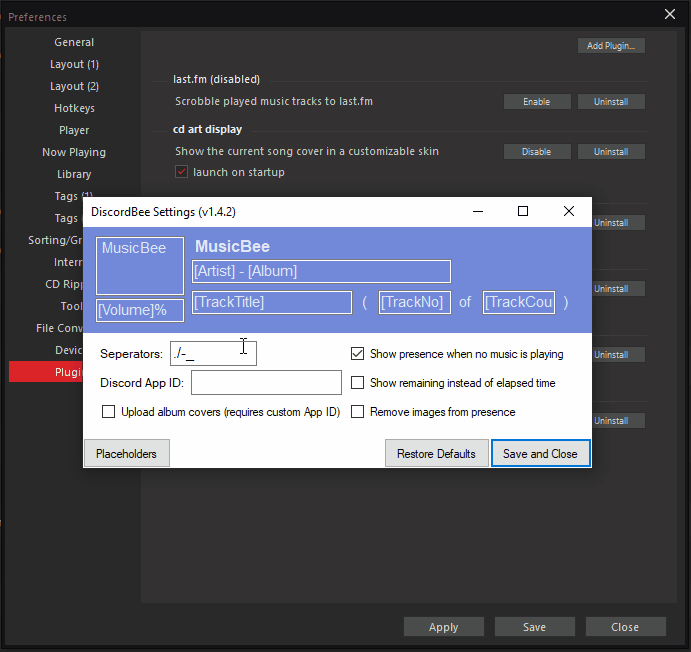

# DiscordBee

MusicBee plugin that updates your Discord status with the currently playing track

## Installation

Just copy all plugin files into your MusicBee Plugins directory (usually "C:\Program Files (x86)\MusicBee\Plugins").

### Microsoft Store Version of MusicBee

If you are using the Store version of MusicBee please use the "Add Plugin" button in MusicBee -> Settings -> Plugins and select the latest release .zip. It may display an error message (something like "... initialise Method not found ..."), ignore it and restart MusicBee. The Plugin should be loaded now.

## Usage

After installing the plugin start MusicBee and your Discord status should be showing informations about your current song.

The Discord API has a 15s rate limit, so it can take up to 15s for a status change to actually show in Discord.

## Configuration

You can configure what is displayed in your profile by opening the plugin settings in MusicBee "Edit -> Preferences -> Plugins -> DiscordBee -> Configure".

The settings window is designed after the Discord profile view and has all elements editable with the default values preloaded. You can use all metadata fields that MusicBee provides in your custom strings. All valid metadata fields in square brackets will be replaced by the values of the currently playing song.

To see which fields are available press the "Placeholders" button and a window will open containing a table with all fields and their values for the current song.

You can also change which characters are treated as seperators. Seperator characters will be stripped in certain conditions e.g. a field is empty and the seperator would be at the end.

If you are unhappy with your changes, you can always restore the defaults and save again.

### Album Covers

For displaying album covers instead of the MusicBee logo you have to register your own Discord Application.

Got to https://discord.com/developers/applications/ and login using the account that the plugin is used with.
Create a new application with a name of your choice using the button on the top right. After doing so you will get an overview of your new application, here you can copy your application ID.

Insert the just copied application ID in the DiscordBee settings and enable the cover upload checkbox. After pressing save DicordBee will automatically start to upload all required icons (e.g. logo, play, pause, ...). After this process is finished album covers will be automatically uploaded and shown on the presence.

After reaching a certain number of assets DiscordBee will automatically remove old ones. So you should never hit the 300 asset limit that is enforced by Discord.

**Attention**:
The API used to upload assets for the Discord application is inconsistent which leads to high delays for newly uploaded assets. It can take up to 10-15 minutes for assets to be available after the upload finished. This includes the asset list in the Discord Developer Dashboard.
So if you don't see any assets in the dashboard or in your discord client after enabling this feature it is mostly due to these issues. There seems to be no way to circumvent this and other developers have also reported this to Discord ([Topic](https://support.discord.com/hc/en-us/community/posts/360050294314-Assets-not-saving-in-Rich-Presence-tab), [Issue](https://github.com/discord/discord-api-docs/issues/2220), [Discussion](https://github.com/discord/discord-api-docs/discussions/3279)).

## Screenshots

## Contributing

Feel free to send pull requests or open issues. The project is a Visual Studio 2019 Solution.

## Libraries and Assets used

- [Discord RPC Sharp](https://github.com/Lachee/discord-rpc-csharp)
- [MusicBee Logo](https://ru.wikipedia.org/wiki/%D0%A4%D0%B0%D0%B9%D0%BB:MusicBee_Logo.png)
